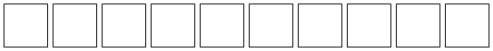
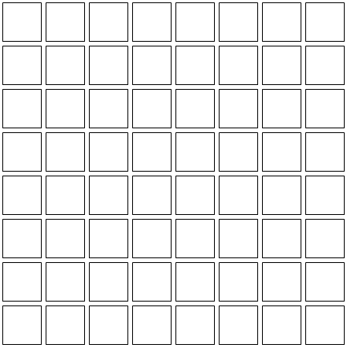
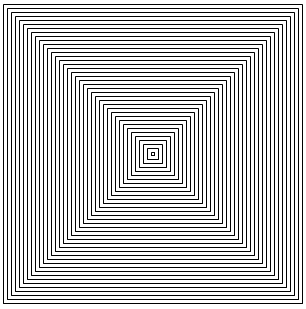
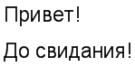
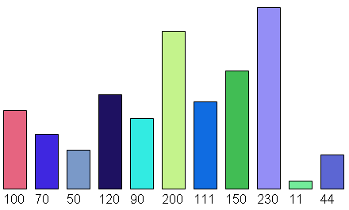
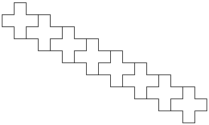
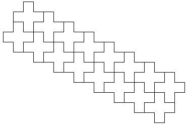
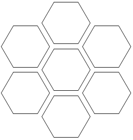
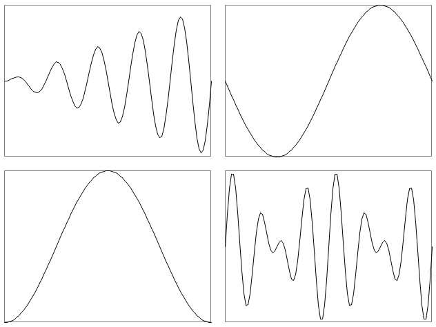

# Графика. Классы штампов

## Хотели как лучше, а получилось как всегда

Обычно начинающие программисты рисуют графические изображения, указывая координаты непосредственно в месте рисования графического объекта. Например, для рисования трех квадратов на равных расстояниях по горизонтали пишут следующий код:

```pascalabc
uses GraphABC;

begin
  Rectangle(30,30,80,80);
  Rectangle(85,30,135,80);
  Rectangle(140,30,190,80);
end.
```

Конечно, такой код плох — лучше попытаться сделать то же самое с помощью цикла:

```pascalabc
uses GraphABC;

begin
  for var i:=0 to 2 do
    Rectangle(30+i*55,30,80+i*55,80);
end.
```

Уже лучше, но опять в коде — «волшебные» константы. Сделаем их именованными:

```pascalabc
uses GraphABC;

const
  x0 = 30;
  y0 = 30;
  w = 50; // размер квадрата
  step = 55; // шаг между квадратами
  n = 10;

begin
  for var i:=0 to n-1 do
    Rectangle(x0+i*step,y0,x0+w+i*step,y0+w);
end.
```

В результате получим следующее изображение:



Ну вот, всё замечательно. Программа хорошая, и на этом статью можно и закончить. Только запись

```pascalabc
x0+i*step,y0,x0+w+i*step,y0+w
```

плоховато читается...

## И что же нам предлагают?

А как же классы штампов? Может, есть какой-то интересный способ, позволяющий сделать код рисования более очевидным?

Да. Такой способ есть. Для того чтобы его понять, давайте посмотрим на рисунок по-другому. Мы рисуем первый квадрат — его координаты определить нетрудно. После этого каждый следующий квадрат надо рисовать, сдвигая предыдущий вправо на расстояние на 5 пикселей больше ширины квадрата. И всё. Как же такое реализовать?

Идея проста: надо вначале запомнить все параметры одного изображения в некоторой составной переменной. В качестве такой составной переменной будем использовать объект некоторого класса. В конструкторе этого класса мы будем инициализировать параметры нашего объекта, а в методе `Stamp` — рисовать объект с сохраненными параметрами.

Это напоминает следующее действие: мы вначале выбираем штамп с заданными параметрами, позиционируем его в нужном месте и — штампуем. В результате получается отпечаток — наше изображение.

Этот способ хорош тем, что достаточно изменить некоторые, но не все параметры и снова вызвать метод `Stamp`. Например, если изменить только координаты объекта, то после вызова `Stamp` он «проштампуется» в другом месте.

## Класс-штамп прямоугольника

В данном случае нам надо нарисовать квадрат или, в общем случае, прямоугольник, поэтому создадим класс `RectangleStamp`:

```pascalabc
type 
  RectangleStamp = class
    x,y,w,h: integer;

    constructor (xx,yy,ww,hh: integer);
    begin
      x := xx;
      y := yy;
      w := ww;
      h := hh;
    end;

    procedure Stamp;
    begin
      Rectangle(x,y,x+w,y+h);
    end;
  end;
```

Здесь `x,y` — левый верхний угол прямоугольника, а `w` и `h` — его ширина и высота.

В конструкторе мы лишь запоминаем эти параметры, а в методе `Stamp` рисуем прямоугольник нужного размера в указанной позиции.

Чтобы нарисовать еще 9 квадратов, будем изменять `x`-координату исходного объекта в цикле на величину, равную ширине квадрата плюс 5, после чего снова штамповать объект.

Вот как выглядит основная программа:

```pascalabc
begin
  var r := new RectangleStamp(30,30,50,50);
  r.Stamp;
  for var i:=1 to 9 do
  begin
    r.x += r.w + 5;
    r.Stamp;
  end;
end.
```

## Класс-штамп шахматной доски

Разовьем эту идею дальше для рисования шахматной доски 8 на 8 клеток.

Для этого создадим класс штампа одного ряда шахматной доски, рисующий 8 клеток. Для рисования будем использовать предыдущий штамп:

```pascalabc
type
  RowRectanglesStamp = class
    x,y,w,h,n: integer;

    constructor (xx,yy,ww,hh,nn: integer);
    begin
      x := xx;
      y := yy;
      w := ww;
      h := hh;
      n := nn;
    end;

    procedure Stamp;
    begin
      var r := new RectangleStamp(x,y,w,h);
      r.Stamp;
      for var i:=1 to n-1 do
      begin
        r.x += r.w + 5;
        r.Stamp;
      end;
    end;
  end;
```

Основная программа снова будет простой:

```pascalabc
const n = 8;

begin
  var r := new RowRectanglesStamp(30,30,50,50,n);
  r.Stamp;
  for var i:=1 to n-1 do
  begin
    r.y += r.h + 5;
    r.Stamp;
  end;
end.
```

Результат:



## Методы увеличения и уменьшения для штампа прямоугольника

Продолжим наши исследования. Доработаем класс `RectangleStamp`, добавив в него метод `MoveOn` перемещения объекта на вектор `dx,dy`, а также методы `IncreaseFromCenter` и `DecreaseFromCenter`, увеличивающие и уменьшающие размер прямоугольника, оставляя на месте его центр:

```pascalabc
type 
  RectangleStamp = class
    x,y,w,h: integer;

    constructor (xx,yy,ww,hh: integer);
    begin
      x := xx;
      y := yy;
      w := ww;
      h := hh;
    end;

    procedure Stamp;
    begin
      Rectangle(x,y,x+w,y+h);
    end;

    procedure MoveOn(dx,dy: integer);
    begin
      x += dx;
      y += dy;
    end;

    procedure IncreaseFromCenter(dw: integer);
    begin
      w += dw*2;
      h += dw*2;
      x -= dw;
      y -= dw;
    end;

    procedure DecreaseFromCenter(dw: integer);
    begin
      IncreaseFromCenter(-dw);      
    end;
  end;
```

Тогда следующая простая программа

```pascalabc
begin
  var r := new RectangleStamp(100,100,300,300);
  r.Stamp;
  while r.w>2 do
  begin
    r.DecreaseFromCenter(4);
    r.Stamp;
  end;
end.
```

выводит ряд уменьшающихся квадратов с общим центром:



Опять-таки, следует обратить особое внимание на короткую и интуитивно понятную основную программу.

## Штамп текста

Создадим также текстовый штамп — он потребуется нам в дальнейшем:

```pascalabc
type 
  TextStamp = class
    x,y,pt: integer;
    Text: string;

    constructor (xx,yy,ppt: integer; t: string);
    begin
      x := xx;
      y := yy;
      pt := ppt; 
      Text := t;
    end;

    procedure Stamp;
    begin
      Font.Size := pt;
      TextOut(x,y,Text);
    end;

    procedure MoveOn(dx,dy: integer);
    begin
      x += dx;
      y += dy;
    end;
  end;
```

Здесь `pt` — размер шрифта в пунктах, а метод `MoveOn` используется для перемещения координат объекта на заданный вектор.

Основная программа, выводящая две фразы одну под другой, имеет вид:

```pascalabc
begin
  var txt := new TextStamp(200,200,14,'Привет!');
  txt.Stamp;
  txt.MoveOn(0,40);
  txt.Text := 'До свидания!';
  txt.Stamp;
end.
```

Результат:



## Группировка штампов. Гистограмма

Следующая идея — объединить несколько простых штампов для создания более сложного.

Например, для создания гистограммы необходимо выводить прямоугольник заданной высоты и подписывать его снизу числом, совпадающим с высотой прямоугольника.

Для вывода гистограммы в цвете немного модифицируем метод `Stamp` для прямоугольника-штампа:

```pascalabc
procedure Stamp;
begin
  Brush.Color := clRandom;
  Rectangle(x,y,x+w,y+h);
end;
```

и для текста-штампа:

```pascalabc
procedure Stamp;
begin
  Font.Size := pt;
  Brush.Color := clWhite;
  TextOut(x,y,Text);
end;
```

После этого создадим штамп прямоугольника с текстовой подписью внизу:

```pascalabc
type
  RectWithTextStamp = class
    rs: RectangleStamp;
    ts: TextStamp;

    constructor (x,y,w,h: integer; t: string);
    begin
      rs := new RectangleStamp(x,y,w,-h);
      ts := new TextStamp(x,y+3,10,t);
    end;

    procedure Draw;
    begin
      rs.Stamp;
      ts.Stamp;
    end;

    procedure MoveOn(dx,dy: integer);
    begin
      rs.MoveOn(dx,dy);
      ts.MoveOn(dx,dy);
    end;

    procedure SetHeight(h: integer);
    begin
      rs.h := -h;
    end;

    procedure SetText(t: string);
    begin
      ts.Text := t;
    end;
  end;
```

Здесь вспомогательные штампы прямоугольника и текста описаны как поля основного штампа, конструируются в конструкторе основного штампа, и выполнение всех операций основной штамп переадресует им.

В частности, метод `Draw` класса `RectWithTextStamp` вызывает методы `Stamp` штампа-прямоугольника и штампа-текста.

Воспользуемся описанным классом для рисования гистограммы, задаваемой массивом чисел:

```pascalabc
begin
  var a: array of integer := (100,70,50,120,90,200,111,150,230,11,44);
  var rt := new RectWithTextStamp(100,300,30,a[0],a[0].ToString);
  rt.Draw;
  for var i:=1 to a.Length-1 do
  begin
    rt.MoveOn(40,0);
    rt.SetHeight(a[i]);
    rt.SetText(a[i].ToString);
    rt.Draw;
  end;
end.
```

Результат:



## Штамп креста. Создание мозаики

Продолжим наши исследования. Создадим более сложный штамп креста:

```pascalabc
type 
  CrossStamp = class
    x,y,w: integer;

    constructor (xx,yy,ww: integer);
    begin
      x := xx;
      y := yy;
      w := ww; 
    end;

    procedure Stamp;
    begin
      MoveTo(x,y);
      LineTo(x+w,y);
      LineTo(x+w,y+w);
      LineTo(x+2*w,y+w);
      LineTo(x+2*w,y);
      LineTo(x+3*w,y);
      LineTo(x+3*w,y-w);
      LineTo(x+2*w,y-w);
      LineTo(x+2*w,y-2*w);
      LineTo(x+w,y-2*w);
      LineTo(x+w,y-w);
      LineTo(x,y-w);
      LineTo(x,y);
    end;

    procedure MoveOn(dx,dy: integer);
    begin
      x += dx;
      y += dy;
    end;
  end;
```

Добавим в этот класс метод `MoveOnRel`, сдвигающий крест на величину, пропорциональную его ширине:

```pascalabc
procedure MoveOnRel(a,b: integer);
begin
  MoveOn(a*w,b*w);
end;
```

Для получения одного ряда мозаики составим следующую программу:

```pascalabc
begin
  var r := new CrossStamp(100,150,20);
  for var i:=1 to 8 do
  begin
    r.Stamp;
    r.MoveOnRel(2,1);
  end;
end.
```

Результат:



При построении следующего ряда возникает неприятная проблема: следующий ряд крестов необходимо начинать с креста, получаемого смещением исходного креста-штампа до изменения его координат. Но в результате выполнения цикла координаты исходного креста изменились.

## Клонирование штампа

Решение проблемы может быть следующим: создадим клон исходного креста-штампа еще до его перемещения.

Для клонирования добавим в класс креста-штампа следующий метод:

```pascalabc
function Clone: CrossStamp;
begin
  Result := new CrossStamp(x,y,w);
end;
```

Он создает крест-штамп с точно такими же параметрами, что и исходный, и возвращает его.

Воспользуемся этим методом, создавая в начале ряда клон `r1` креста-штампа `r` и сдвигая именно его на вектор `(2,1)`. После этого сдвинем исходный крест-штамп вниз на вектор `(-1,2)` и повторим указанные действия 2 раза:

```pascalabc
begin
  var r := new CrossStamp(100,150,20);
  for var k:=1 to 2 do
  begin
    var r1 := r.Clone;
    for var i:=1 to 8 do
    begin
      r1.Stamp;
      r1.MoveOnRel(2,1);
    end;
    r.MoveOnRel(-1,2);
  end;
end.
```

Результат:



Очевидно, модифицировав данную программу, нетрудно получить мозаику из крестов.

## Штамп шестиугольника

Следующий вариант использования штампов также связан с мозаиками. Но на этот раз мозаика выполняется штампами-правильными шестиугольниками, что приводит к необходимости хранить в классе штампа вещественные координаты:

```pascalabc
type 
  RegularPolygonStamp = class
    x,y,r: real;
    n: integer;

    constructor (xx,yy,rr: real; nn: integer);
    begin
      x := xx;
      y := yy;
      r := rr;
      n := nn;
    end;

    procedure Stamp;
    begin
      var t := 0.0;
      var xr := r*cos(t);
      var yr := r*sin(t);
      MoveTo(Round(x+xr),Round(y+yr));
      for var i:=1 to n do
      begin
        t += 2*Pi/n;
        xr := Round(r*cos(t));
        yr := Round(r*sin(t));
        LineTo(Round(x+xr),Round(y+yr));
      end;  
    end;

    procedure MoveOn(dx,dy: real);
    begin
      x += dx;
      y += dy;
    end;

    function Clone: RegularPolygonStamp;
    begin
      Result := new RegularPolygonStamp(x,y,r,n);
    end;
  end;
```

Обратим внимание, что вещественные координаты превращаются в целые лишь при выводе.

Построим с помощью этого штампа шестиугольник в центре экрана, окруженный с каждой стороны шестиугольниками того же размера.

Для этого в цикле будем клонировать исходный шестиугольник и смещать его на нужный вектор. Длина этого вектора равна двум высотам равностороннего треугольника со стороной, совпадающей с радиусом шестиугольника.

Нетрудно видеть, что удвоенная высота равна `Sqrt(3)*r`, где `r` — радиус шестиугольника. Нетрудно также видеть, что первый угол поворота этого вектора равен 1/12 от 360 градусов.

Итак, код:

```pascalabc
begin
  var r := new RegularPolygonStamp(Window.Center.X,Window.Center.Y,50,6);
  r.Stamp;
  var t := 2*Pi/12;
  var rr := r.r*Sqrt(3)+10;
  for var i:=1 to 6 do
  begin
    var r1 := r.Clone;
    r1.MoveOn(rr*cos(t),rr*sin(t));
    r1.Stamp;
    t += 2*Pi/6;
  end;
end.
```

Здесь в выражении

```pascalabc
r.r*Sqrt(3)+10
```

величина `10` необходима для формирования отступа между шестиугольниками.

В результате запуска такой программы получаем:



Наконец, в заключение нашей короткой :) статьи приведем еще один полезный штамп — штамп рисования графика заданной функции в заданном прямоугольнике.

## Штамп графика функции

В этой программе используются не очень сложные для вывода формулы, которые преобразуют «мировой» прямоугольник с вещественными координатами `(xf0,yf0,wf,hf)` в «экранный» прямоугольник с целыми координатами `(xs0,ys0,ws,hs)`.

Здесь `x,y` — левый верхний угол каждого прямоугольника, а `w,h` — их ширина и высота.

Формулы преобразования из «мировых» координат `(xf,yf)` в экранные `(xs,ys)` имеют вид:

```pascalabc
a := ws/wf;
b := xs0-a*xf0;
c := hs/hf;
d := ys0-c*yf0;

xs := Round(a*xf+b);
ys := hs + 2*ys0 - Round(c*yf+d);
```

Здесь `a,b,c,d` — промежуточные коэффициенты.

В правильность этих формул мы просим либо поверить, либо доказать эти формулы самостоятельно. На выбор.

Далее приводим полный тип класса-штампа для рисования графика функции в прямоугольнике:

```pascalabc
type 
  FuncType = function (r: real): real;

  FuncStamp = class
    xs0,ys0,ws,hs: integer;
    xf0,yf0,wf,hf: real;
    f: FuncType;

    constructor (
      xs0p,ys0p,xs1p,ys1p: integer;
      xf0p,yf0p,xf1p,yf1p: real;
      ff: FuncType
    );
    begin
      SetScreenWindow(xs0p,ys0p,xs1p,ys1p);
      SetFuncWindow(xf0p,yf0p,xf1p,yf1p);
      f := ff;
    end;

    function WorldToScreenX(xf: real): integer;
    begin
      var a := ws/wf;
      var b := xs0-a*xf0;
      Result := Round(a*xf+b);
    end;

    function WorldToScreenY(yf: real): integer;
    begin
      var c := hs/hf;
      var d := ys0-c*yf0;
      Result := hs + 2*ys0 - Round(c*yf+d);
    end;

    procedure Stamp;
    const n = 100;
    begin
      Pen.Color := Color.Gray;
      Rectangle(xs0,ys0,xs0+ws,ys0+hs);
      Pen.Color := Color.Black;
      var x := xf0;
      var y := f(x);
      var h := wf/n;
      var xs := WorldToScreenX(x);
      var ys := WorldToScreenY(y);
      MoveTo(xs,ys);
      for var i:=1 to n do
      begin
        x += h;
        y := f(x);
        xs := WorldToScreenX(x);
        ys := WorldToScreenY(y);
        LineTo(xs,ys);
      end;  
    end;

    procedure SetScreenWindow(xs0p,ys0p,xs1p,ys1p: integer);
    begin
      xs0 := xs0p;
      ys0 := ys0p;
      ws := xs1p-xs0p;
      hs := ys1p-ys0p;
    end;

    procedure SetFuncWindow(xf0p,yf0p,xf1p,yf1p: real);
    begin
      xf0 := xf0p;
      yf0 := yf0p;
      wf := xf1p-xf0p;
      hf := yf1p-yf0p;
    end;

    procedure MoveOn(dx,dy: integer);
    begin
      xs0 += dx;
      ys0 += dy;
    end;
  end;
```

Обратим внимание на несколько деталей.

1. В конструкторе мы инициализируем оба прямоугольника — «мировой» и «экранный» — координатами левого верхнего и правого нижнего углов, а в классе храним координаты левого верхнего угла, ширину и высоту прямоугольников. Так оказывается удобнее.

2. Мы создаем отдельные методы `SetScreenWindow` и `SetFuncWindow` для изменения соответствующих окон класса-штампа вывода функции в ходе работы программы. Первый нужен, чтобы выводить тот же участок функции в другом месте экрана, а второй — чтобы выводить другой участок функции.

3. Функция передается в класс-штамп в виде процедурной переменной:

   ```pascalabc
   FuncType = function (r: real): real;
   ```

4. При рисовании графика функции вначале серым цветом рисуется прямоугольник, в границах которого рисуется график.

Реализуем также пару функций, которые мы будем выводить в разных окнах:

```pascalabc
function f(x: real): real;
begin
  Result := x*sin(5*x);
end;  

function g(x: real): real;
begin
  Result := sin(3*x)+sin(4*x);
end;
```

Вот код основной программы:

```pascalabc
begin
  var fs := new FuncStamp(10,10,310,230,0,-2*Pi,2*Pi,2*Pi,f);
  fs.Stamp;

  fs.MoveOn(320,0);
  fs.SetFuncWindow(-Pi,-1,Pi,1);
  fs.f := sin;
  fs.Stamp;

  fs.MoveOn(-320,240);
  fs.f := cos;
  fs.Stamp;

  fs.MoveOn(320,0);
  fs.SetFuncWindow(-2*Pi,-2,2*Pi,2);
  fs.f := g;
  fs.Stamp;
end.
```

Он выводит четыре графика функций в четырех окнах — прямоугольниках на экране.

Результат:



## Итоги

Подведем итоги. Мы использовали одну идею — создание классов-штампов — для запоминания ряда параметров рисуемого графического объекта. Часть этих параметров мы затем меняли, как правило координаты, после чего рисовали объект вызовом метода `Stamp`.

Заметим, что мы практически не использовали ряд средств объектно-ориентированного программирования, таких как свойства, защита доступа, наследование и полиморфизм, которые крайне уместны при реализации классов-штампов и могут быть задействованы учащимися для создания собственных классов-штампов.

У классов мы использовали лишь их самую главную роль — быть кирпичиками гибко изменяемого конструктора, из которых можно строить весьма нетривиальные и красивые программы.

